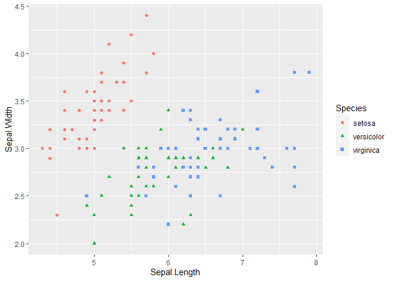
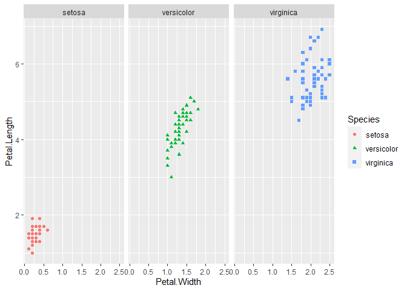
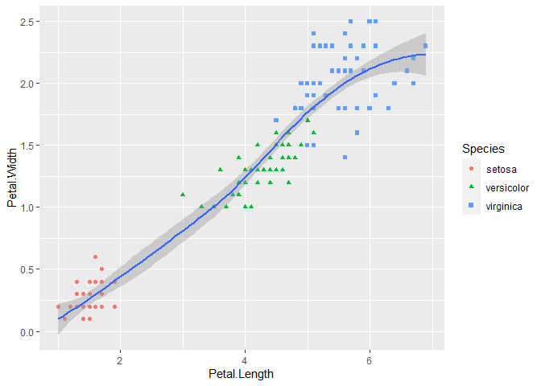
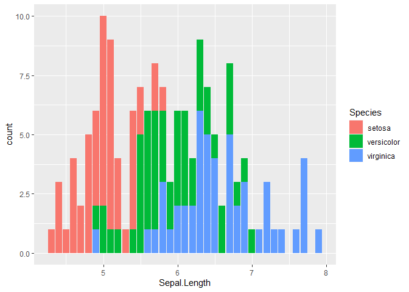

task 3 DTS 350: Visualizations
pakages

```r
#load in packages
library(tidyverse)
```

```
## ── Attaching packages ─────────────────────────────────────── tidyverse 1.3.2 ──
## ✔ ggplot2 3.3.6      ✔ purrr   0.3.4 
## ✔ tibble  3.1.8      ✔ dplyr   1.0.10
## ✔ tidyr   1.2.1      ✔ stringr 1.4.1 
## ✔ readr   2.1.2      ✔ forcats 0.5.2 
## ── Conflicts ────────────────────────────────────────── tidyverse_conflicts() ──
## ✖ dplyr::filter() masks stats::filter()
## ✖ dplyr::lag()    masks stats::lag()
```

look at the dataset and all look at the struture.

```r
#top and bottom of the data set, structure if the data set.
head(iris)
```

```
##   Sepal.Length Sepal.Width Petal.Length Petal.Width Species
## 1          5.1         3.5          1.4         0.2  setosa
## 2          4.9         3.0          1.4         0.2  setosa
## 3          4.7         3.2          1.3         0.2  setosa
## 4          4.6         3.1          1.5         0.2  setosa
## 5          5.0         3.6          1.4         0.2  setosa
## 6          5.4         3.9          1.7         0.4  setosa
```

```r
tail(iris)
```

```
##     Sepal.Length Sepal.Width Petal.Length Petal.Width   Species
## 145          6.7         3.3          5.7         2.5 virginica
## 146          6.7         3.0          5.2         2.3 virginica
## 147          6.3         2.5          5.0         1.9 virginica
## 148          6.5         3.0          5.2         2.0 virginica
## 149          6.2         3.4          5.4         2.3 virginica
## 150          5.9         3.0          5.1         1.8 virginica
```

```r
str(iris)
```

```
## 'data.frame':	150 obs. of  5 variables:
##  $ Sepal.Length: num  5.1 4.9 4.7 4.6 5 5.4 4.6 5 4.4 4.9 ...
##  $ Sepal.Width : num  3.5 3 3.2 3.1 3.6 3.9 3.4 3.4 2.9 3.1 ...
##  $ Petal.Length: num  1.4 1.4 1.3 1.5 1.4 1.7 1.4 1.5 1.4 1.5 ...
##  $ Petal.Width : num  0.2 0.2 0.2 0.2 0.2 0.4 0.3 0.2 0.2 0.1 ...
##  $ Species     : Factor w/ 3 levels "setosa","versicolor",..: 1 1 1 1 1 1 1 1 1 1 ...
```

Create a graph compareing the Sepal Length and the Sepal Width of each Species.

```r
#Now Lets make a graph
ggplot(data = iris) + 
  geom_point(mapping = aes(x = Sepal.Length, y = Sepal.Width, color = Species, shape = Species))
```

<!-- -->

```r
#Question.) what can we learn about the species when comparing sepal length and sepal width.
#Answer.) from the data displayed we can see that setosa species seems to have wider a wider sepal while versicolor and virginica have similar sepal length and widths. 
```


Make a graph comparing petal length and petal width for each species

```r
ggplot(data = iris) + 
  geom_point(mapping = aes(x = Petal.Width, y = Petal.Length, color = Species, shape = Species))+
  facet_wrap(~ Species)
```

<!-- -->

```r
#QUestion.)What are the differences in the petals between the sepcies?
#Answer.) Setosa has relatively small petals, where as vesicolor have bigger petals than the setosa and smaller petals than Virginica so they can be considered medium sized, Virginica has the largest petals out of all the species.
```

Make a graph compareing the petals width and length and put a line of best fit on it.

```r
ggplot(data = iris) + 
  geom_point(mapping = aes(x = Petal.Length, y = Petal.Width, color = Species, shape = Species))+
  geom_smooth(mapping = aes(x= Petal.Length, y = Petal.Width))
```

```
## `geom_smooth()` using method = 'loess' and formula 'y ~ x'
```

<!-- -->

```r
#What does that line of best fit tell us about the iris data?
#This tells us as we change specie left to right we are getting bigger petals for the species. It is a gradual increase, as Petal length increases so does Petal width.
```

Make a bar chart using the data that tells us something about the data

```r
ggplot(data = iris, mapping = aes(x = Sepal.Length, fill = Species)) +
  geom_bar()
```

<!-- -->

```r
#What does this graph tell us about the data?
# this shows us how much of the data overlaps even though the species are different they are good amount of overlapping but still seeing a general trend that each species has a different Sepal.Length. 
```


